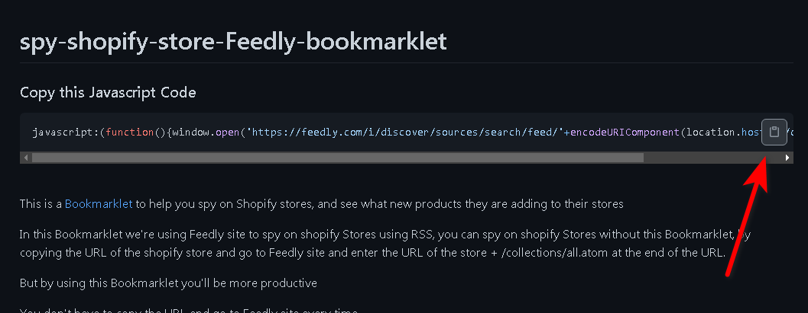

# spy-shopify-store-Feedly-bookmarklet


### Copy this Javascript Code

```javascript
javascript:(function(){window.open('https://feedly.com/i/discover/sources/search/feed/'+encodeURIComponent(location.host)+'/collections/all.atom');})()
```
<br/>

This is a <a href="http://en.wikipedia.org/wiki/Bookmarklet">Bookmarklet</a> to help you spy on Shopify stores, and see what new products they are adding to their stores

In this Bookmarklet we're using Feedly site to spy on shopify Stores using RSS, you can spy on shopify Stores without this Bookmarklet, by copying the URL of the shopify store and go to Feedly site and enter the URL of the store + /collections/all.atom at the end of the URL.

But by using this Bookmarklet you'll be more productive

You don't have to copy the URL and go to Feedly site every time

just one simple click will open a new browser tab and search for the shopify RSS and you just need to click on follow to follow the store.

<h2>How to use this Bookmarklet</h2>

<ol>
  <li>Create an account on <a href="https://feedly.com">feedly</a></li>
  <li>copy the Javascript Code from above 
  </li>
  
  
  
  <li>Right click on the bookmarks bar, and choose "Add Page"
    
   
    
  </li>
 
  <li>Enter a name, and in the URL put the code that you've copied from above, and click save.
    
  
    
  </li>
  <li>Go to any shopify store and click on the Bookmarklet </li>
    
</ol>

## Note:
<ol>
  <li>
If you don't find the bookmarks bar, Go to Settings on chrome browser, and on the left side click on Appearance (chrome://settings/appearance), after that click on "Show bookmarks bar"
    </li>


  
  <li>You can also add the Bookmarklet to opera and Firefox Browser</li>
  
  </ol>
